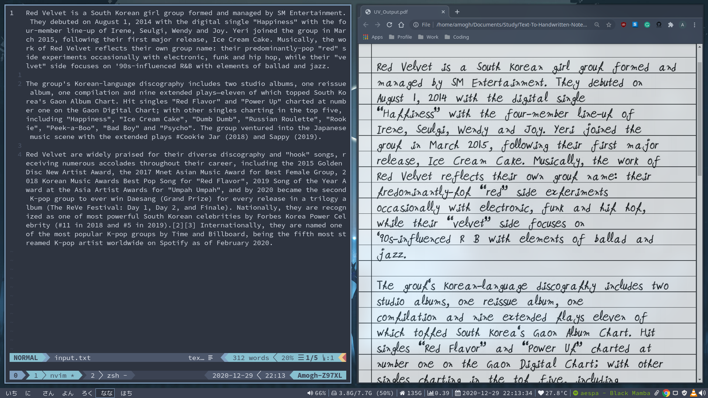
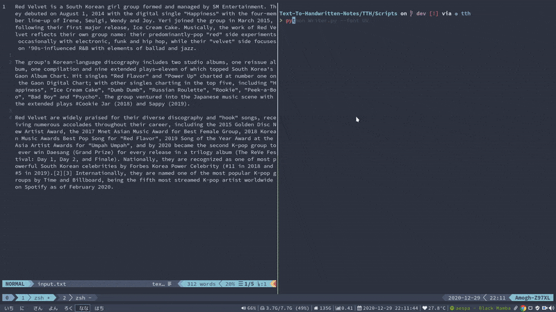

<h3 align="center"> Text To Handwritten Notes </h3>

<p align="center">
Converts text into a PDF of handwritten notes
    <br />
    <a href="#"><strong> Explore the docs » </strong></a>
    <br />
    <br />
    ·
    <a href="#">Report Bug</a>
    ·
    <a href="#">Request Feature</a>
    ·
</p>



### Steps:

```bash
$ git clone https://github.com/YuvrajSingh-16/Text-To-Handwritten-Notes.git
$ cd Text-To-Handwritten-Notes/TTH
$ pip install -r requirements.txt
$ cd Scripts
$ python Writer.py --font FONT_NAME
```

### Working



Note: Change the Variable FONT_NAME to the font you want

Supported Fonts

- Piyush
- Rajat
- Swagat
- UV

## Contributing:

Contributions are what makes the open source community such an amazing place to learn, inspire, and create. Any contributions you make are **greatly appreciated**.

All you simply need to do is:

1. Fork the Project
2. Create your Feature Branch (`git checkout -b feature/AmazingFeature`)
3. Commit your Changes (`git commit -m 'Add some AmazingFeature'`)
4. Push to the Branch (`git push origin feature/AmazingFeature`)
5. Open a Pull Request
